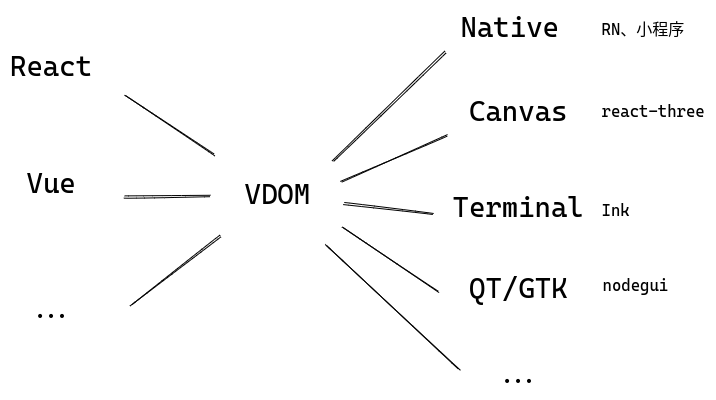

# mini-framework

A minimal implementation for React and Vue, for fun and personal learning.

For more information, read my post [here](https://github.com/EverSeenTOTOTO/frontend-interview/blob/main/Framework.md).



Example code can be found in [index.html](./index.html).

**React**:

```ts
const {div, button, h, createRoot, useState, useEffect} = window.React;

const Counter = (state) => div([`Clicked ${state.count}`], {
  style: {
    width: 300,
    height: 50,
    color: state.color,
    bgColor: '#e4e4e4'
  },
});

const App = () => {
  const [count, setCount] = useState(0);
  const [color, setColor] = useState('blue');

  useEffect(() => console.log(count), [count]);
  useEffect(() => console.log(color), []);

  return div([
    h(Counter, {count, color}),
    button(
      ['Increment'],
      {
        onClick: () => setCount(count + 1),
      },
    ),
    button(
      ['Change Color'],
      {
        onClick: () => setColor(color === 'blue' ? 'red' : 'blue'),
      },
    ),
  ])
};

createRoot(document.getElementById('react')).render(h(App));
```

## Targets

The VDOM layer can be compiled to different targets:

1. Web: normally render to HTML DOM

    

2. Canvas: compile to virtual render instructions and paint in `canvas`

    

3. QT: render to [nodegui](https://github.com/nodegui/nodegui) components

4. Terminal: render to terminal

5. ...
